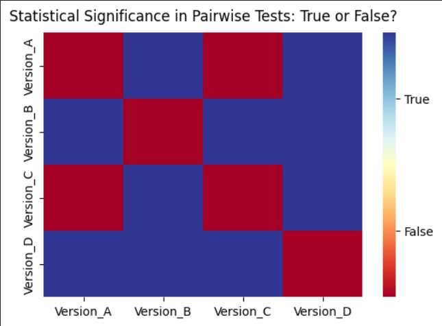

# Eniac Website A/B Testing: Click-Through Rate Analysis Using Chi-Square Test

## 🎯 Project Overview

This project analyses the performance of four website versions (A, B, C, and D) for an e-commerce platform by evaluating their click-through rates (CTR). The goal is to determine whether there is a statistically significant difference in user engagement across versions and identify the best-performing design.

Using a Chi-Square Test for Independence along with post-hoc pairwise comparisons, the analysis evaluates whether observed differences in click behavior are statistically meaningful or due to random variation.

## 📊 Dataset & Sources

### Source:
Provided case study datasets (Google Drive links)

### Files Used:

- eniac_a.csv
- eniac_b.csv
- eniac_c.csv
- eniac_d.csv
  
### Structure:

- Clicks and no-click counts for each website version
- Aggregated user interaction data per version

### Key Variables:

- Clicks per version
- No-clicks per version
- Total visits per version
- Click-through rate (CTR)

## 🚀 Key Findings & Results

- There is a statistically significant difference in click-through rates across website versions (Chi-square test, α = 0.05).
- Version C achieved the highest CTR overall, indicating strong user engagement.
- Post-hoc pairwise testing shows:
  - Version C is significantly different from Versions B and D
  - Version C is not significantly different from Version A
- Version A also performs strongly, making it a close competitor to Version C.
  
## 🛠️ Technologies Used

### Programming:

- Python

### Libraries:

- pandas
- numpy
- scipy
- seaborn
- matplotlib

### Statistical Methods:

- Chi-Square Test for Independence
- Post-hoc pairwise chi-square comparisons
- Bonferroni correction (alpha adjustment)

### Environment:

- Jupyter Notebook / Google Colab

## 📁 Project Structure

    📦eniac-ab-testing/
    │
    ├── 📂 data/
    │   ├── eniac_a.csv
    │   ├── eniac_b.csv
    │   ├── eniac_c.csv
    │   ├── eniac_d.csv
    │
    ├── 📜 notebooks/
    │   └── eniac_ab_testing_analysis.ipynb
    │
    ├──📂 visuals/
    │   └── statistical_significance_heatmap.png
    │
    └── README.md

## 📈 Visualisations

### 🔥 Statistical Significance Heatmap

This heatmap shows pairwise statistical significance between website versions based on Chi-Square tests.

- The RdYlBu color palette is used to represent results:
  - Blue → No statistically significant difference (False)
  - Yellow → Neutral / borderline cases
  - Red → Statistically significant difference (True)

This helps identify which website versions differ significantly in user engagement and click-through performance.

## 📌 Business Insights

- Version C achieved the highest click-through rate (CTR) overall.
- Version A also performed strongly and remained close to Version C.
- Versions B and D showed lower engagement levels.
- Statistical testing confirmed significant differences between some website versions.
- CTR alone may not be sufficient for making the final business decision.

## 🎯 Conclusion

The Chi-Square test indicates that website performance differs significantly across versions. Although Version C recorded the highest CTR, its performance was not significantly different from Version A in post-hoc analysis. Therefore, both Version C and Version A can be considered the strongest-performing versions.

Further evaluation using additional business metrics and repeated testing is recommended before selecting a final website version.

## 🔗 How to Use This Project

1. Open the main analysis notebook:
 👉 [View Notebook](./notebooks/eniac_ab_testing_analysis.ipynb)

3. Ensure all dataset files are available in the `/data` folder:
   - eniac_a.csv
   - eniac_b.csv
   - eniac_c.csv
   - eniac_d.csv

4. Run all notebook cells sequentially to:
   - Compute Click-Through Rates (CTR)
   - Perform Chi-Square statistical testing
   - Conduct post-hoc pairwise analysis
   - Generate heatmap visualisations

5. Review the business insights and conclusion section for final interpretation.

